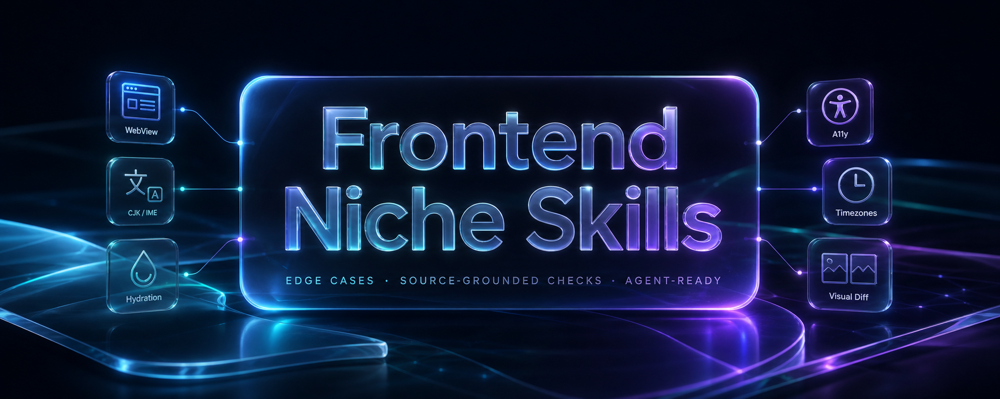

<div align="center">

</div>

# Frontend Niche Skills

<p align="center">
<a href="#skills"></a>
<a href="https://claude.com/product/claude-code"></a>
<a href="https://github.com/openai/codex"></a>
<a href="#skills"></a>
<a href="./LICENSE"></a>
</p>

<p align="center">
<a href="README.md">🇺🇸 English</a> | <strong>🇰🇷 한국어</strong> | <a href="README.ja.md">🇯🇵 日本語</a> | <a href="README.zh-cn.md">🇨🇳 简体中文</a>
</p>

**광범위한 체크리스트가 자주 놓치는 프론트엔드 엣지 케이스를 위한 Agent Skills — WebView 페이지, 시맨틱 마크업, 오버레이 생명주기, IME/CJK 입력, 하이드레이션, 폼, 인증, 결제 페이지, 내보내기, 날짜, 시각적 충실도, 리포트 트리아지까지.**

`frontend-niche-skills`는 Claude Code, Codex를 비롯한 `AGENTS.md` 호환 코딩 에이전트에게, 올바른 수정이 증거 유형의 구분에 달려 있는 버그를 위한 집중된 플레이북을 제공합니다: 레이아웃 vs 페인트, DOM vs 접근성 트리, 브라우저 vs 네이티브 WebView 호스트, 서버 렌더 vs 클라이언트 하이드레이션, 결제 페이지 데이터 경계 vs 런타임 스크립트 표면, 내보내기 파일 vs 스프레드시트/Blob/클립보드 동작.

이 skill들은 프로젝트 컨벤션, 보안 리뷰, QSA/법무 결정, 실제 브라우저/기기 테스트를 대체하지 않습니다. 그럴듯하지만 범용적인 수정을 적용하기 전에 에이전트가 올바른 증거를 먼저 요구하도록 돕습니다.

## 목차

- [설치](#설치)
- [빠른 예시](#빠른-예시)
- [Workflow](#workflow)
- [Skills](#skills)
- [증상 맵](#증상-맵)
- [증거](#증거)
- [개발 검사](#개발-검사)
- [FAQ](#faq)
- [라이선스](#라이선스)

## 설치

[`skills` CLI](https://www.skills.sh/)를 설치하세요. skill은 [`SKILL.md` 포맷](https://agentskills.io/specification)을 따릅니다.

아래의 `voidmatcha/frontend-niche-skills` 명령은 공개 저장소 또는 plugin marketplace 항목이 있다는 것을 전제합니다. 로컬 또는 사전 릴리스 checkout에서는 이 섹션의 로컬 checkout 명령을 대신 사용하세요.

```bash
# Claude Code + Codex via skills CLI
npx skills add voidmatcha/frontend-niche-skills --skill '*' -g -a claude-code -a codex

# Other agents supported by the installed skills CLI
npx skills add voidmatcha/frontend-niche-skills --skill '*' -g --agent '*'
```

### Claude Code plugin

```bash
/plugin marketplace add voidmatcha/frontend-niche-skills
/plugin install frontend-niche-skills@voidmatcha
```

### Codex plugin 로컬 checkout

이 저장소에는 `.codex-plugin/plugin.json`과 Claude plugin manifest가 포함되어 있습니다. 로컬 checkout에서:

```bash
codex plugin marketplace add "$(pwd)"
codex plugin add frontend-niche-skills@frontend-niche-skills
```

설치하거나 업데이트한 뒤에는 번들 skill이 갱신되도록 새 Codex 또는 Claude Code 세션을 시작하세요.

## 빠른 예시

```text
You: Review this React Native WebView onboarding page. The CTA area is still
clickable after app resume, but the button label and footer text disappear.

frontend-niche-skills / webview-bridge-pages:

[Diagnosis] Separate layout, hit-test, and paint evidence
- Footer box exists and receives taps.
- Missing pieces are child text/button paint, not bridge routing.
- Reproduce in the native app WebView, not only desktop Chrome.

Likely fix direction
- Remove stale JS height measurement if flex layout can own the footer.
- If hit-test survives but children vanish, inspect compositing/layering:
  isolation boundary, child z-index, transform layer promotion, gradient fallback.

Verification
- Resume/reopen WebView, rotate if relevant, and capture screenshot/video.
- Confirm the CTA is both visible and tappable; do not accept click-only evidence.
```

이 패턴은 에이전트가 또 하나의 범용 패치를 적용하기 전에 올바른 가설부터 검증하게 만듭니다.

## Workflow

1. **증상에 맞는 skill을 고릅니다.** 버그와 실패 유형이 일치하는 가장 좁은 skill을 사용하세요.
2. **저장소 컨텍스트를 읽습니다.** skill을 프로젝트의 라우팅, 디자인 토큰, i18n, 테스트, 브라우저/기기 지원과 함께 사용하세요.
3. **증거 유형을 구분합니다.** 레이아웃, 페인트, 히트 테스트, DOM 구조, 접근성 트리, 네트워크, 하이드레이션, 로케일 동작, 런타임 스크립트, 내보낸 파일은 서로 다르게 말할 수 있습니다.
4. **증상이 아니라 원인을 고칩니다.** 재시도를 추가하기보다 취약한 타이밍이나 중복된 로직을 제거하는 쪽을 우선하세요.
5. **올바른 호스트에서 검증합니다.** WebView 버그에는 앱 WebView 증거가, 결제 페이지 검토에는 런타임 스크립트/PAN 경계 증거가, 시각적 충실도에는 레퍼런스/렌더 캡처가 필요하며, 폼/접근성 이슈는 가능하면 회귀 테스트로 남기세요.

## Skills

33개의 skill을, 각 skill이 겨냥하는 프론트엔드 실패 유형별로 묶었습니다. 리포트가 어수선하거나 여러 도메인에 걸쳐 있다면 `frontend-report-triage`부터 시작하세요.

실용적인 우선순위:

- **기본 우선순위 검사:** SSR/딥링크 라우팅, 폼 검증, 날짜/시간, 인증/보안, 결제/내보내기 경계, 오버레이, 접근성, 시맨틱 HTML. 흔하거나 릴리스 후 비용이 큰 버그를 잡아냅니다.
- **호스트/제품 특화 검사:** WebView, 브라우저 iframe/embed, CJK/IME, i18n/RTL, 결제 페이지 증거는 제품이 해당 기능을 실제로 제공할 때 가장 가치가 큽니다.
- **품질/유지보수 검사:** 디자인 충실도와 컴포넌트 추출 판단은 리뷰에서 문제가 되는 것이 런타임 버그가 아니라 디자인과 어긋난 화면(`visual drift`), AI 생성 UI, 성급한 추상화일 때 유용합니다.

출처 관리 방식: README에는 라우팅 문서와 증거 문서만 나열하고, 상세한 인용은 각 skill의 `## Sources` 블록 또는 `references/*.md` 파일에 둡니다. README에 모든 upstream URL을 중복해서 담지 않기 위해서입니다.

### 여기서 시작

| Skill | 사용 시점 |
| --- | --- |
| [`frontend-report-triage`](./skills/frontend-report-triage/SKILL.md) | 모호하거나 증상이 여럿인 프론트엔드 버그 리포트를 팩 전체에 걸쳐 트리아지합니다. 가능성 높은 실패 유형, 증거 공백, 가장 적합한 후속 skill 1-3개를 돌려줍니다. |

### 런타임 호스트 엣지

| Skill | 사용 시점 |
| --- | --- |
| [`webview-bridge-pages`](./skills/webview-bridge-pages/SKILL.md) | 네이티브 WebView 안에서 로드되는 페이지를 만들거나 디버깅할 때: bridge 계약, safe-area/뷰포트 레이아웃, 생명주기, 히트 테스트 vs 페인트/컴포지팅, 앱 호스트별 특이 동작. |
| [`iframe-embed-contracts`](./skills/iframe-embed-contracts/SKILL.md) | 브라우저 iframe/widget을 만들거나 디버깅할 때: 부모-게스트 메시지, 임베드 허용 헤더, sandbox/Permissions Policy, READY/init 핸드셰이크, 동적 크기, 파티션 스토리지(`partitioned storage`), 리스너 정리(teardown). |
| [`deeplink-hydration`](./skills/deeplink-hydration/SKILL.md) | 라우터 하이드레이션이 준비되기 전에 쿼리 파라미터를 잃거나 잘못된 상태에 도달하는 SPA/SSR 딥링크를 디버깅할 때. |
| [`ssr-hydration-mismatch`](./skills/ssr-hydration-mismatch/SKILL.md) | 로케일/시간/난수/브라우저 전용 API, 스토리지, 인증 상태, 반응형 분기, 데이터 경쟁에서 비롯된 하이드레이션 불일치를 진단할 때. |
| [`realtime-transport-contracts`](./skills/realtime-transport-contracts/SKILL.md) | 연결 끊김을 넘나드는 WebSocket/SSE 클라이언트를 디버깅할 때: 재연결 backoff/jitter, SSE Last-Event-ID/커서 재개, delta 순서 뒤바뀜/중복/누락, heartbeat/좀비 감지, `bufferedAmount` backpressure, 열린 소켓에서의 인증 갱신. |

### 마크업, 접근성, 오버레이

| Skill | 사용 시점 |
| --- | --- |
| [`semantic-markup-contracts`](./skills/semantic-markup-contracts/SKILL.md) | 네이티브 HTML 구조를 리뷰할 때: 버튼 vs 링크, 제목(heading), 랜드마크, 레이블, 표/목록, 잘못된 인터랙티브 중첩, ARIA보다 네이티브를 우선하는 수정. |
| [`overlay-focus-scroll-contracts`](./skills/overlay-focus-scroll-contracts/SKILL.md) | 모달, 드로어, 시트, 팝오버, 메뉴, 커맨드 팔레트의 런타임 계약을 리뷰할 때: 포커스 트랩/복원, inert/aria-hidden 타이밍, 중첩 스택, 스크롤 잠금 정리. |
| [`a11y-contract-testing`](./skills/a11y-contract-testing/SKILL.md) | 접근성 시맨틱을 회귀 테스트로 바꿀 때: role, name, state, 포커스, 다이얼로그, 메뉴, 콤보박스, 탭. |
| [`view-transitions-contracts`](./skills/view-transitions-contracts/SKILL.md) | 조용한 중단(silent abort), 오래된 스냅샷, reduced-motion 무시, 고스트 잔상이 발생하는 View Transitions API 애니메이션을 리뷰할 때 — 재구현 가이드가 아니라 리뷰와 PR 가치 판단용입니다. |
| [`css-transition-animation-contracts`](./skills/css-transition-animation-contracts/SKILL.md) | 다이얼로그/팝오버/top-layer의 진입/이탈 트랜지션(`@starting-style`, `allow-discrete`, `overlay`)과 트랜지션 완료에 걸어 둔 정리 로직(`transitionend` vs `getAnimations().finished`)을 리뷰할 때. |
| [`responsive-image-contracts`](./skills/responsive-image-contracts/SKILL.md) | 반응형 이미지 마크업을 리뷰할 때: 실제 레이아웃 대비 `srcset`/`sizes`, 고유 픽셀 너비(`w` descriptor), LCP eager/`fetchpriority`, `picture` 아트 디렉션, CLS를 위한 `width`/`height`. |

### 입력, 콘텐츠, 시간

| Skill | 사용 시점 |
| --- | --- |
| [`cjk-text-and-input`](./skills/cjk-text-and-input/SKILL.md) | 한국어, 일본어, 중국어 텍스트/입력을 다룰 때: 줄바꿈, IME 조합(composition), Enter 처리, grapheme 안전 길이, 검증 타이밍. |
| [`i18n-copy-and-layout`](./skills/i18n-copy-and-layout/SKILL.md) | 현지화 카피/레이아웃을 리뷰할 때: 복수형 처리, 텍스트 확장, bidi/RTL, 로케일 포맷팅, 번역 키 계약. |
| [`datetime-correctness`](./skills/datetime-correctness/SKILL.md) | 날짜/시간 코드를 감사할 때: 시간대, DST, 파싱, 포맷팅, `datetime-local`, 상대 시간, 서버/클라이언트 시계 문제. |
| [`money-and-precision-contracts`](./skills/money-and-precision-contracts/SKILL.md) | 돈/수량 연산: 부동소수점 드리프트(`0.1 + 0.2`), 정수 최소 단위 vs decimal 라이브러리, `toFixed`/반올림 모드의 함정, 합산/세금 계산 순서, `Intl` 통화 출력 vs 현지화된 금액 파싱. |

### 폼, 인증, 보안, 결제

| Skill | 사용 시점 |
| --- | --- |
| [`constraint-validation-contracts`](./skills/constraint-validation-contracts/SKILL.md) | 네이티브 HTML Constraint Validation API 계약: `setCustomValidity`, `reportValidity`, `:user-invalid`, invalid에서 valid로 이어지는 생명주기. |
| [`js-form-validation-contracts`](./skills/js-form-validation-contracts/SKILL.md) | React Hook Form, Formik, Final Form, vee-validate, Valibot 또는 커스텀 JS 폼 플로우: `stale` 오류 상태, 비활성화된 제출 버튼, 비동기/서버 경쟁, 서버 필드 오류 매핑. |
| [`frontend-auth-flow-contracts`](./skills/frontend-auth-flow-contracts/SKILL.md) | 브라우저를 향한 인증을 강화할 때: returnTo 리다이렉트, OAuth/passkey/autocomplete 계약, 토큰 저장 경계, CSRF 엣지. |
| [`frontend-security-baseline`](./skills/frontend-security-baseline/SKILL.md) | 프론트엔드 XSS, DOM 주입, sanitizer 오용, CSP, 서드파티 스크립트, 스토리지, URL 파싱 기본기를 점검할 때. |
| [`bff-proxy-security-contracts`](./skills/bff-proxy-security-contracts/SKILL.md) | 프론트엔드가 소유한 BFF/API 프록시를 점검할 때: 클라이언트가 target을 고르는 SSRF, route/method/auth capability allowlist, 우회 유입 경로(ingress), multipart 예산/boundary, redirect/오류 처리, upstream 비즈니스 플로우 책임 구분. |
| [`payment-page-client-security`](./skills/payment-page-client-security/SKILL.md) | 체크아웃/결제 페이지의 클라이언트 증거를 리뷰할 때: hosted field vs 직접 PAN 처리, 런타임 스크립트 인벤토리, 서드파티 스크립트 위험, CSP/SRI/헤더 증거, PCI DSS 증거 공백. |
| [`optimistic-update-rollback-contracts`](./skills/optimistic-update-rollback-contracts/SKILL.md) | 낙관적 UI 업데이트: 서버 확인 전에 변경 적용, 임시 ID vs 서버 ID, 실패 시 롤백, refetch/invalidation과의 `reconcile`, 응답과 백그라운드 refetch 사이의 경쟁. |
| [`file-ingest-contracts`](./skills/file-ingest-contracts/SKILL.md) | 드래그 앤 드롭, 파일 입력, 붙여넣기로 파일을 페이지에 들여올 때: drop 이벤트 취소/`dropEffect`, dragenter/leave 깜빡임, `DataTransfer` items vs files, 디렉터리 업로드, `accept`/`file.type` 신뢰 문제, object URL 미리보기 생명주기. |

### 출력, 디자인, 추상화, 유지보수

| Skill | 사용 시점 |
| --- | --- |
| [`download-export-safety`](./skills/download-export-safety/SKILL.md) | CSV/Excel 내보내기, Blob/Object URL 다운로드, 클립보드 쓰기, 생성된 파일명, 내보내기 특유의 데이터 경계를 리뷰할 때. |
| [`design-to-code-fidelity`](./skills/design-to-code-fidelity/SKILL.md) | 내보내기, 캡처, 시각적 diff, 증거 등급화를 통해 구현을 디자인 레퍼런스와 비교할 때. |
| [`component-extraction-judgment`](./skills/component-extraction-judgment/SKILL.md) | 반복되는 UI를 공유 컴포넌트, 래퍼, 훅, 토큰으로 만들지, 아니면 분리된 채로 둘지 판단할 때. |
| [`client-error-observability-contracts`](./skills/client-error-observability-contracts/SKILL.md) | 프론트엔드 오류 수집을 연결할 때: `window.onerror`/`unhandledrejection`, error boundary의 한계, cross-origin에서 발생하는 `Script error.` 블랙아웃, source map 배포 vs 업로드, 그룹핑, PII 스크러빙. |

### 성능, 데이터, 오프라인

| Skill | 사용 시점 |
| --- | --- |
| [`core-web-vitals-performance-contracts`](./skills/core-web-vitals-performance-contracts/SKILL.md) | Core Web Vitals(LCP, CLS, INP) 또는 TTFB가 나쁠 때, 수정에 앞서 원인을 특정 요소, 레이아웃 이동, 메인 스레드 작업으로 좁힙니다 — 점수 확인이 아니라 페이지 전체 `performance budget`을 관리하기 위한 skill입니다. |
| [`frontend-data-fetching-cache-contracts`](./skills/frontend-data-fetching-cache-contracts/SKILL.md) | 클라이언트 데이터 캐시(React Query, SWR, RTK Query, Apollo)가 뮤테이션 후 오래된 데이터를 보여 주거나, 요청 워터폴, 과다/과소 fetch, 페이지네이션/재검증 캐시 버그가 있을 때. |
| [`async-effect-race-contracts`](./skills/async-effect-race-contracts/SKILL.md) | 직접 작성한 async Effect가 오동작할 때: 의존성 변경 시 발생하는 fetch 경쟁(오래된 응답이 이기는 경우), 누락된 cleanup/`AbortController`, StrictMode 이중 호출, interval/구독의 `stale closure`. |
| [`pwa-offline-cache-contracts`](./skills/pwa-offline-cache-contracts/SKILL.md) | Service Worker/오프라인 캐싱이 잘못될 때: 배포 후 오래된 빌드, `ChunkLoadError`, precache 공백, 캐시 버전 관리/축출(cache eviction), SW 업데이트 생명주기, 인증된 응답 캐싱. |
| [`large-list-data-grid-contracts`](./skills/large-list-data-grid-contracts/SKILL.md) | 가상화된 리스트/그리드가 튀거나 스크롤 위치를 잃을 때, 또는 화면 밖 행이 unmount되어 페이지 내 찾기 / 스크린 리더 총계 / 포커스가 깨질 때; 고정 컬럼/헤더 드리프트. |

## 증상 맵

그룹별 skill 목록을 훑어본 뒤에 사용하세요. 실패 신호에서 출발해 가장 구체적인 런타임 증거를 먼저 고르고, 필요하면 이웃 skill로 넘기세요.

| 실패 신호 | 시작할 skill | 먼저 물어볼 질문 |
| --- | --- | --- |
| 페이지가 React Native WebView, WKWebView, Android WebView, Flutter WebView 또는 인앱 브라우저 안에서 실행되며, safe area, 키보드, 재개(resume), bridge, 페인트가 데스크톱 Chrome과 다릅니다. | `webview-bridge-pages` | 레이아웃, 히트 테스트, 페인트/컴포지팅, bridge 타이밍, 호스트 생명주기 중 무엇의 문제인가? |
| 브라우저 iframe/widget이 비어 있거나, 위조 메시지를 받거나, READY/init을 놓치거나, 크기 조절 중 깜빡이거나, 필요한 권한이 없거나, 임베드 로그인 상태를 잃습니다. | `iframe-embed-contracts` | 정확한 부모/게스트 origin, 전달된 frame 정책, 인증된 메시지 핸드셰이크, 크기 프로토콜, 스토리지 모드는 무엇인가? |
| HTML 구조 자체가 의심스럽습니다: div 버튼, 잘못된 링크, 레이블/제목/목록, 잘못된 인터랙티브 중첩. | `semantic-markup-contracts` | ARIA, CSS, JavaScript보다 먼저 네이티브 HTML로 표현할 수 있는가? |
| 모달, 드로어, 시트, 팝오버, 메뉴, 커맨드 팔레트가 겉보기에는 멀쩡한데 포커스, 배경 상호작용, Escape/backdrop, 스크롤 잠금이 실패합니다. | `overlay-focus-scroll-contracts` | 열기, 중첩 열기, 닫기, unmount, 라우트 변경 시 각각 무슨 일이 일어나는가? |
| 다이얼로그, 메뉴, 콤보박스, 탭, 커스텀 위젯에 접근성 회귀 커버리지가 필요합니다. | `a11y-contract-testing` | 테스트가 role, name, state, 포커스 계약을 assert할 수 있는가? |
| 한국어, 일본어, 중국어 텍스트/입력이 잘못 동작합니다: IME Enter, 조합(composition), grapheme 길이, 줄바꿈, 말줄임. | `cjk-text-and-input` | 코드가 조합 중 텍스트, 확정된 텍스트, 표시되는 텍스트를 뒤섞고 있는가? |
| 번역된 카피가 레이아웃, 복수형 처리, bidi/RTL, 숫자/날짜 포맷팅, 번역 키 계약을 깨뜨립니다. | `i18n-copy-and-layout` | 버그가 카피, 레이아웃, 로케일 동작, 입력 조합 중 어디에 있는가? |
| 딥링크, 인증 리다이렉트, SPA/SSR 라우트, 쿼리 파라미터가 잘못된 화면으로 초기화됩니다. | `deeplink-hydration` | 라우터 준비, 하이드레이션, 인증 바운스 이전의 URL 상태는 무엇인가? |
| WebSocket 또는 SSE 클라이언트가 연결 끊김을 넘기지 못합니다: 재연결 폭풍, 중복/누락 이벤트, 순서가 뒤바뀐 델타, OPEN이지만 죽은 소켓에서 멈춘 UI, 버퍼 증가, 핸드셰이크 후 만료된 토큰. | `realtime-transport-contracts` | 재연결/backoff, 재개/커서, delta folding, liveness/heartbeat, backpressure, 소켓 재인증 중 무엇의 문제인가? |
| 브라우저를 향한 인증 UI에 returnTo, OAuth/passkey, autocomplete, OTP, 토큰 저장, CSRF 엣지 문제가 있습니다. | `frontend-auth-flow-contracts` | 인증 플로우가 지켜야 할 브라우저 계약은 무엇인가? |
| 결제 페이지 밖에서 raw HTML, sanitizer, CSP, opener, 스토리지, URL 파싱, 서드파티 스크립트 위험이 나타납니다. | `frontend-security-baseline` | 구체적인 브라우저 보안 source-to-sink 경로가 있는가? |
| 프론트엔드 소유 서버 라우트가 클라이언트가 고른 path, upload, header, business action을 upstream API로 프록시합니다. | `bff-proxy-security-contracts` | 어떤 route-method-auth capability가 노출되고, 다른 ingress가 정책을 우회할 수 있는가? |
| 체크아웃/결제 페이지에 클라이언트 측 증거가 필요합니다: hosted field, 직접 PAN/CVV 처리, 런타임 스크립트, CSP/SRI/헤더 통제. | `payment-page-client-security` | 결제 데이터 경계와 런타임 스크립트 표면을 보여 주는 증거는 무엇인가? |
| CSV/Excel 내보내기, 파일 다운로드, Blob URL, 클립보드 쓰기, 생성된 파일명, 내보내기 스키마가 관련되어 있습니다. | `download-export-safety` | 브라우저를 떠나는 것은 무엇이고, 스프레드시트 셀, Object URL, 클립보드 실패, 파일명은 어떻게 처리되는가? |
| 날짜가 밀리거나, 시간대/DST 문제, 날짜 전용 입력, `datetime-local` 왕복, 상대 시간, 서버/클라이언트 시계 불일치가 있습니다. | `datetime-correctness` | 그 값은 instant인가, 로컬 date-time인가, 날짜 전용 값인가, 포맷된 표시 문자열인가? |
| 돈/수량 합계가 소수점이나 최소 화폐 단위에서 어긋나거나, 반올림이 이상해 보이거나, 현지화된 금액이 잘못 파싱됩니다. | `money-and-precision-contracts` | 값이 이진 부동소수점으로 계산되는가, 그리고 계산이 어떤 반올림 모드와 최소 단위 표현을 쓰는가? |
| 네이티브 Constraint Validation API가 관련되어 있습니다: `setCustomValidity`, `reportValidity`, `:user-invalid`, invalid에서 valid로의 생명주기. | `constraint-validation-contracts` | 네이티브 validity가 올바른 시점에 해제되고 보고되는가? |
| React Hook Form, Formik, Final Form, vee-validate, Valibot 또는 커스텀 JS 검증에 오래된 오류, 비활성화된 제출, 비동기/서버 경쟁이 있습니다. | `js-form-validation-contracts` | 어느 라이브러리 상태가 오류, 유효성, 제출, 서버 필드 매핑을 소유하는가? |
| 하이드레이션 경고나 서버/클라이언트 불일치에 로케일, 시간, 난수, 브라우저 전용 API, 스토리지, 인증 상태, 반응형 분기가 얽혀 있습니다. | `ssr-hydration-mismatch` | 첫 클라이언트 렌더에서 deterministic해야 하는 것은 무엇인가? |
| 구현이 Figma, 스크린샷, 디자인 레퍼런스, `visual spec`과 일치해야 합니다. | `design-to-code-fidelity` | 주관적인 리뷰 전에 레퍼런스를 내보내고, 렌더를 캡처하고, diff할 수 있는가? |
| 반복되는 UI를 컴포넌트, 래퍼, 훅, 토큰으로 만들지, 분리된 채로 둘지 고민됩니다. | `component-extraction-judgment` | 제품 간 차이를 숨기지 않고 추출할 만큼 중복이 안정적인가? |
| 서버 확인 전에 적용된 낙관적 UI 업데이트가 잘못 동작합니다: 깜빡임, 이중 적용, 롤백되지 않는 실패한 뮤테이션, 응답이 refetch와 경쟁한 뒤 남는 오래된 데이터. | `optimistic-update-rollback-contracts` | apply -> confirm/rollback -> reconcile 계약은 무엇이고, 임시/서버 ID와 동시 뮤테이션은 어떻게 순서가 정해지는가? |
| 페이지로 들여온 파일이 오동작합니다: 드롭 존 하이라이트가 깜빡이거나, 드롭한 파일이 페이지를 다른 곳으로 이동시키거나, 드롭한 폴더에서 아무것도 나오지 않거나, 잘못된 타입의 파일이 통과하거나, 이미지 붙여넣기가 깨지거나, 미리보기 URL이 누수됩니다. | `file-ingest-contracts` | ingest pipeline의 어느 단계가 실패하는가: drag 이벤트 취소, `DataTransfer` items vs files, 타입 신뢰, 붙여넣기, object URL 생명주기? |
| 프론트엔드 오류가 대시보드에서 누락되거나, 읽을 수 없거나(minified / `Script error.`), error boundary가 있는데도 앱이 흰 화면이 됩니다. | `client-error-observability-contracts` | 비동기/rejection까지 수집이 연결되어 있는가, cross-origin/source map 설정이 올바른가, 전송 전에 무엇이 스크러빙되는가? |
| View Transitions 애니메이션이 오동작합니다: 무작위 `silent abort`, `stale snapshot` 정지, reduced-motion 무시, `ghost morph`가 발생합니다. | `view-transitions-contracts` | 중복된 `view-transition-name`인가, 페인트되지 않은 snapshot(Suspense/decode)인가, 누락된 reduced-motion 블록인가, 잘못된 Transition 래핑인가? |
| 다이얼로그/팝오버의 진입 또는 이탈 애니메이션이 끊기거나, 트랜지션이 결코 "완료"되지 않아 정리/포커스/unmount가 멈춰 있습니다. | `css-transition-animation-contracts` | 트랜지션에 `display`/`overlay`(및 `allow-discrete`)가 빠져 있는가, 아니면 결코 발생하지 않는 `transitionend`에 코드가 걸려 있는가? |
| 잘못된 이미지 파일이 배포되거나, 이미지가 과도하게 다운로드되거나, 히어로 이미지가 lazy 로딩되거나, 이미지가 레이아웃 이동을 일으킵니다. | `responsive-image-contracts` | `srcset`에 실제 레이아웃과 일치하는 `sizes`, 올바른 너비 서술자, LCP `eager`/`fetchpriority`, `width`/`height`가 있는가? |
| 페이지의 LCP/CLS/INP가 실패하고, 점수 보고가 아니라 원인을 특정해야 합니다. | `core-web-vitals-performance-contracts` | LCP 요소는 무엇이고(발견 가능한가/우선순위가 잡혔는가), 각 레이아웃 이동의 출처는 무엇이며, 어떤 long task가 INP를 부풀리는가? |
| 뮤테이션 후 클라이언트 캐시 데이터가 오래되었거나, 요청이 워터폴을 이루거나 과다 fetch합니다(React Query/SWR/RTK Query/Apollo). | `frontend-data-fetching-cache-contracts` | 어느 query key를 무효화해야 하고, 읽기가 올바른 stale/gc 타이밍으로 병렬화되어 있는가? |
| 비동기 effect가 잘못된 데이터를 보여 주거나, 두 번 실행되거나, 누수되거나, 오래된 값을 읽습니다. | `async-effect-race-contracts` | take-latest/`AbortController` + cleanup이 있는가, 그리고 effect가 StrictMode에서 멱등한가? |
| 배포 후 사용자에게 오래된 빌드가 전달되거나, `ChunkLoadError`가 나거나, service worker가 오프라인에서 잘못된/오래된 바이트를 제공합니다. | `pwa-offline-cache-contracts` | SW 업데이트 플로우, 완전한 precache, 캐시 버전 관리, 인증된 HTML/API에 대한 캐시 금지 규칙이 있는가? |
| 가상화된 리스트/그리드가 튀거나 스크롤을 잃거나, 가상화 아래에서 Ctrl+F / 스크린 리더 총계 / 포커스가 깨집니다. | `large-list-data-grid-contracts` | `estimateSize`/overscan이 올바른가, 그리고 unmount된 행에 `aria-setsize`/`aria-posinset`(또는 `aria-rowcount`)가 설정되어 있는가? |
| 리포트가 모호하거나, 여러 도메인에 걸쳐 있거나, 어떤 전문 skill이 맡아야 할지 확신이 없습니다. | `frontend-report-triage` | 가능성 높은 실패 유형 상위 1-3개는 무엇이고, 이를 구별해 줄 증거는 무엇인가? |

## 증거

이 저장소는 grep 매치를 곧 버그로 취급하지 않습니다. 문서는 확인된 예시, 후보 단서, positive control, 알려진 오탐(false positive)을 구분합니다.

증거의 위치:

- [`docs/oss-validation-cases.md`](./docs/oss-validation-cases.md) — skill 경계와 PR 형태를 점검(sanity-check)하는 데 사용한 공개 OSS 사례.
- [`docs/oss-maintainer-candidate-backlog.md`](./docs/oss-maintainer-candidate-backlog.md) — 파일/라인 증거가 있는 공개 OSS 리서치 후보. 제보 전에 현재 기본 브랜치를 다시 확인하고 로컬에서 재현하세요.
- [`docs/why-webview-bridge-pages.md`](./docs/why-webview-bridge-pages.md) — WebView 특화 선행 사례, bridge 라이브러리, 호스트 동작 레퍼런스, 생태계 노트.
- [`docs/skill-evidence-coverage.md`](./docs/skill-evidence-coverage.md) — skill별로 근거가 검증된 사례, 후보 단서, 1차 출처 레퍼런스, 라우팅 예시 중 어디에서 오는지 보여 주는 맵.
- [`docs/frontend-report-triage.md`](./docs/frontend-report-triage.md) — 통합 리포트 트리아지 계약과 예시.
- `skills/*/SKILL.md` 및 `skills/*/references/*.md` — skill별 공식 문서, 선행 사례, 예시, 오탐 노트, 구현 특화 증거.

후보 OSS 발견은 현재 브랜치를 다시 확인하고, 로컬에서 재현하고, 메인테이너가 수락하거나 실패하는 테스트로 뒷받침되기 전까지는 확인된 upstream 버그가 **아닙니다**.

## 개발 검사

저장소 로컬 검사는 직접 실행하거나 lefthook을 통해 실행할 수 있습니다:

```bash
./scripts/pre-push-checks.sh

# Optional: install Git hooks after installing lefthook locally.
lefthook install
lefthook run pre-push
```

`lefthook.yml`은 저장소 스크립트에 위임만 하므로, 기여자는 lefthook 없이도 같은 검사를 실행할 수 있습니다. 이 스크립트는 skill 메타데이터, README 링크/개수, plugin manifest, 로컬 마크다운 링크, 과장 표현, 번들 스크립트 문법을 감사하고 `git diff --check`도 실행합니다. 옵트인 검사인 `python3 scripts/audit-skill-pack.py --check-links`로 외부 출처 URL이 여전히 유효한지 확인할 수 있으며, 링크 교체 절차는 [docs/skill-evidence-coverage.md](./docs/skill-evidence-coverage.md)에 있습니다. CI에서는 `.github/workflows/checks.yml`이 모든 push와 pull request마다 같은 스크립트를 실행하고, `.github/workflows/link-check.yml`이 매주 링크 검사를 돌려 죽은 인용이 발견되면 `link-rot` 이슈를 등록합니다.

## FAQ

### 범용 프론트엔드 체크리스트인가요?

아니요. 이 skill들은 범용 UI 리뷰가 자주 놓치는 프론트엔드 엣지에 집중합니다: WebView 호스트 동작, 네이티브 HTML 구조, IME/CJK 입력, 접근성 계약, 하이드레이션, 폼, 날짜/시간, 인증, 결제 페이지 클라이언트 증거, 내보내기, 오버레이, `design fidelity`.

### `payment-page-client-security`가 PCI 범위를 결정하나요?

아니요. 이 skill은 프론트엔드 증거를 수집합니다: 결제 페이지 스크립트 인벤토리, PAN/CVV 경계, CSP/SRI/헤더 통제, PCI DSS 6.4.3/11.6.1 논의 지점. 범위와 컴플라이언스는 QSA, 매입사(acquirer), 결제 담당자, 보안 담당자가 결정합니다.

### 프로젝트 로컬 규칙을 대체해야 하나요?

아니요. 프로젝트 로컬 컨벤션은 그대로 유지하세요: 라우팅, 컴포넌트, 디자인 토큰, 인증 모델, 테스트 runner, 브라우저/기기 매트릭스, 릴리스 게이트. 이 skill들은 이슈 특화 플레이북으로 사용하세요.

### 왜 하나의 거대한 skill이 아닌가요?

작은 skill이 컨텍스트를 집중시킵니다. 어수선한 리포트를 위해 `frontend-report-triage`가 있지만, 모든 skill을 로드하기보다 가장 작고 유용한 집합으로 라우팅해야 합니다.

## 라이선스

Apache-2.0 © [voidmatcha](https://github.com/voidmatcha). [LICENSE](./LICENSE)를 참고하세요.
